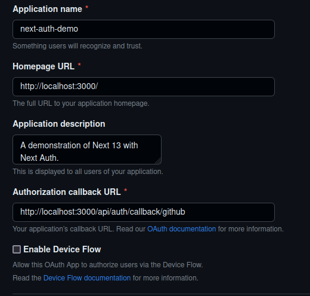
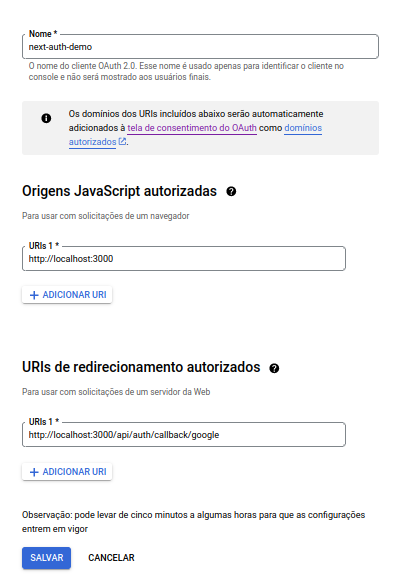

<div align="center">
  <h1>Next Auth Demo</h1>
  <p>Demonstração de uso do Next.js 13 com o NextAuth.js</p>
  <a href="#testando-o-projeto">Testando o projeto</a> •
  <a href="#configurando-o-projeto">Configurando o projeto</a> •
  <a href="#explicando-os-arquivos">Explicando os arquivos</a>
</div>

## Testando o projeto

Leve em consideração é que o foco dessa demo foi o NextAuth, por isso não foi
integrado nenhum banco de dados à aplicação. Então, para testar o _sign-in_
customizado com email e senha, utilize os dados fictícios que irão logar com
sucesso:

```js
{
  email: "ana@gmail.com",
  senha: "ana12345"
}
```

> Também podem ser encontrados no arquivo `app/api/**/options.ts`.

## Configurando o projeto

As únicas configurações necessárias serão criar um novo OAuth app no Github e no
google cloud para preencher corretamente o arquivo `.env`.

### OAuth app via Github

Para criar um novo OAuth app caso deseje testar a aplicação, é necessário ir em
`Settings > Developer Settings > OAuth Apps > New OAuth App`, após isso, preencha
da seguinte maneira:



Após isso, guarde o id e o secret informados.

### OAuth via google

Para criar as credenciais de autorização do Google, será necessário criar uma
conta no [Google Cloud](https://console.cloud.google.com). Logo em seguida, caso
não tenha um projeto criado, será necessário criar um para utilizar o serviço.


Após isso:

1. Vá para a [página de credenciais](https://console.developers.google.com/apis/credentials?hl=pt-br)
2. Antes de ir ao próximo passo, configure a _Tela de permissão OAuth_
3. Siga para `Credenciais > + Criar credenciais` e selecione **ID do cliente OAuth**
4. Selecione _Aplicativo da Web_ e preencha com os dados a seguir:



> Lembrando que o nome é de sua escolha.

Por fim, se tudo deu certo, será possível visualizar sua _secret_ e o _client id_
para salvar nas variáveis de ambiente.

## Explicando os arquivos

#### `app/api/**/options.ts`

- O objeto `options` é onde você definirá sua configuração de autenticação;
- O array `providers` contém as instâncias dos provedores de autenticação que
  estão sendo usados;
- Já em `CredentialsProvider`, podemos configurar uma autenticação personalizada
  baseada em formulário, na qual verificamos as credenciais informadas numa fonte
  de dados. No caso do projeto, foi usado apenas um usuário fictício para a
  autenticação;
- O objeto de `pages` permite que customizemos as rotas usadas pelo NextAuth,
  nesse caso, a propriedade de `signIn` aponta para a página de _sign-in_.

#### `app/api/**/route.ts`

Nesse arquivo, `handler` é uma função que irá lidar com as requisições e as
respostas de autenticação, baseando-se na configuração fornecida em `options.ts`.
Exportando esse `handler` como `GET` e `POST`, garante que a função possa ser
usada em ambos os tipos de requisição.

#### `app/(view)/signin/page.tsx`

Arquivo que lida com a renderização e a lógica da página de _sign-in_.

- `const providers = await getProviders()` busca os provedores de autenticação
  disponíveis da aplicação, eles serão usados para mostrar as opções disponíveis
  para se registrar;
- `const session = await getServerSession(options)` recupera a sessão do usuário
  usando as opções de autenticação fornecidas. Se uma sessão existe (o usuário já
  autenticado), o usuário será redirecionado para a _home page_ por conta do
  `if(session)` informado, senão, o formulário de `sign-in` é renderizado,
  fornecendo os _providers_ de autenticação disponíveis;

#### `app/components/SignInForm/SignInForm.tsx`

O `SignInForm` é o componente que renderiza o formulário com os inputs de email
e senha, incluindo:

- Validação por meio do `react-hook-form`;
- Integração da autenticação utilizando o `next-auth/react`, por meio da função
  de `signIn()` para iniciar o processo de login baseado no _provider_ informado
  no primeiro parâmetro. Por exemplo, no `handleSubmit` será o processo
  customizado (email e senha) pois foi nomeado de _"credentials"_ no arquivo de
  `options.ts`. Se `redirect: true`, o usuário é redirecionado para a página de
  login do _provider_ informado. Uma vez autenticado, é feito o redirecionamento
  para o `callbackUrl` informado, que no caso do login customizado o usuário irá
  para home do projeto;
- fornece outras opções de _login_ com outros provedores de autenticação;
- lida com _query params_ para informar erros caso necessário.

#### `app/contexts/SessionProvider.tsx`

O propósito desse _provider_ é fornecer o gerenciamento de sessão de
autenticação para a aplicação. Note que ele é informado logo no `RootLayout` em
`app/layout.tsx`.

#### `middleware.ts`

Adiciona _middleware_ para proteger as rotas que precisam de autenticação na
aplicação, além de configurar os headers para permitir requisições _cross-origin_. Mas caso queira proteger apenas algumas, é necessário exportar uma
configuração com o _matcher_ de rotas à serem protegidas. No caso dessa demo, a
única rota que precisará de autenticação, será a principal e caso não autenticado,
haverá o redirecionamento para a tela de _signin_.

> **Nota:** é importante informar quais rotas precisam de autenticação, mesmo
> que sejam a maioria, para evitar erros como `ERR_TOO_MANY_REDIRECTS` no google
> ou `Firefox has detected that the server is redirecting the request to this address in a way that will never be completed`
> no firefox, pois muitas vezes o projeto pode ter lógicas de redirecionamento,
> como nessa demo, que caso a página principal (`/`) seja acessada e não esteja
> logado, o redirecionamento era feito para `/signin`, e por não ter _matcher_ à
> priori, _signin_ também estava protegida, ocorrendo o loop de redirecionamentos.

<hr>

<p align="center">
  Feito com 🖤 por
  <a align="center" href="https://www.linkedin.com/in/ana-beatriz-nunes/">
    Ana Beatriz Nunes
  </a>
</p>
